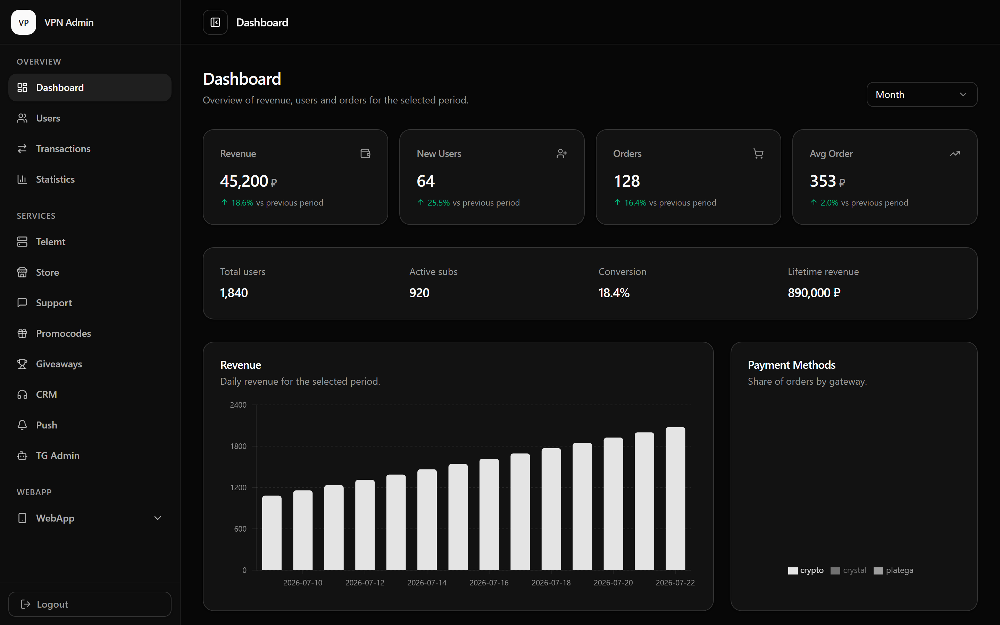
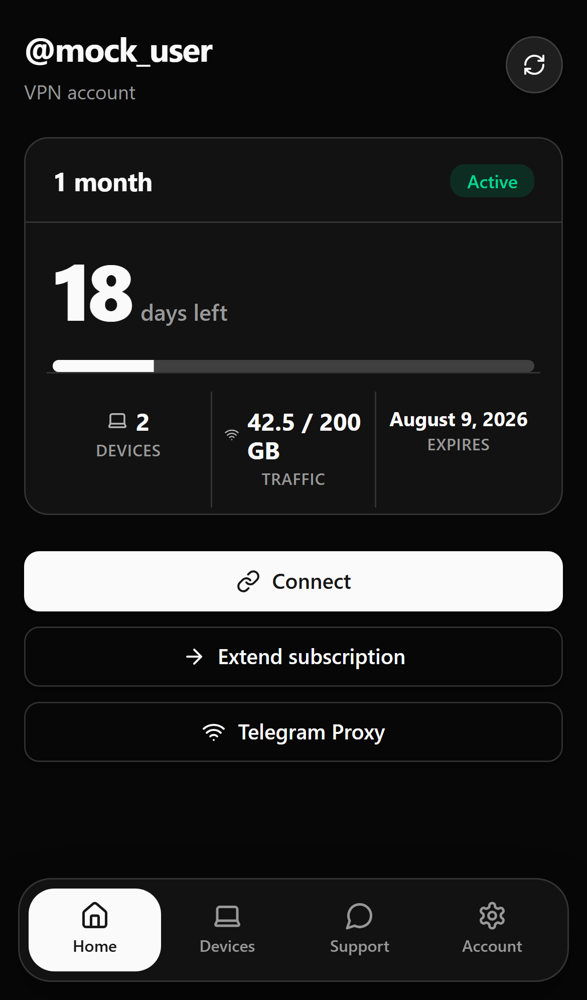
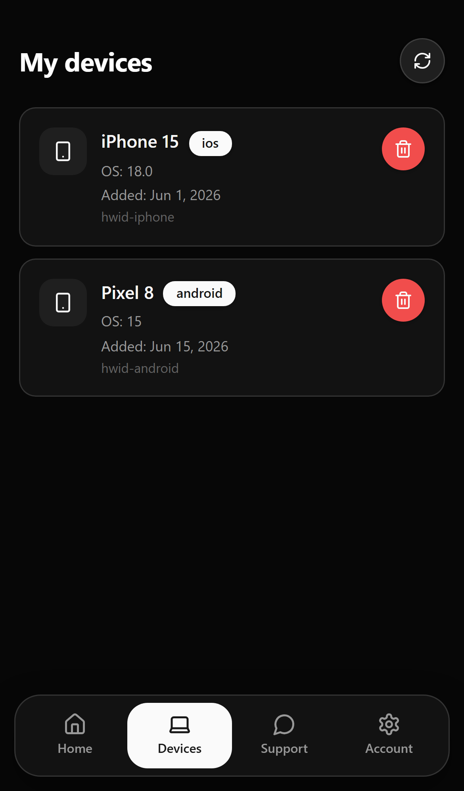
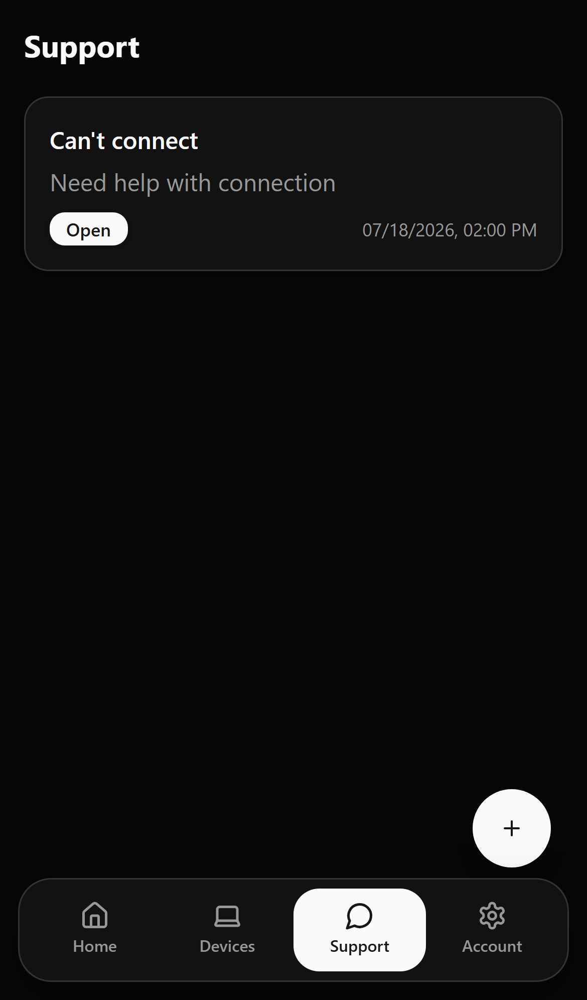
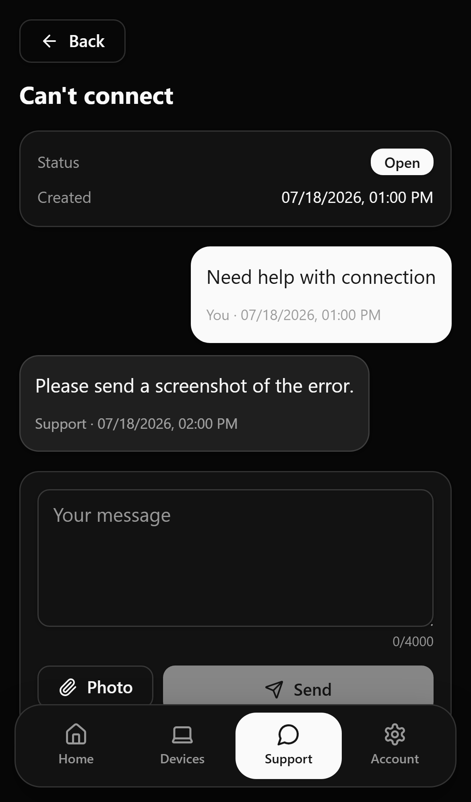
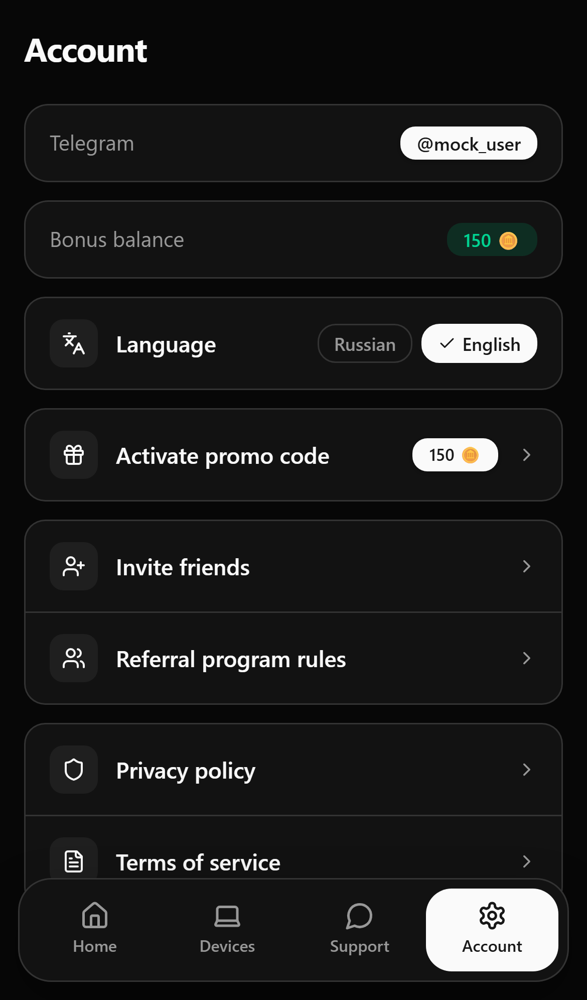

# CheezyShop

**Remnawave subscription store** — Python, FastAPI, React, PostgreSQL, and Docker Compose.
Includes a Telegram bot, MiniApp, and a [Dashboard with a rich set of tools](#key-features).

[Website](https://l0nelynx.github.io/xray-vpn-bot/) · [Docs](https://l0nelynx.github.io/xray-vpn-bot/docs/) · [Getting started](https://l0nelynx.github.io/xray-vpn-bot/docs/getting-started/)

[](https://l0nelynx.github.io/xray-vpn-bot/docs/payment-gateways/)
[](https://hub.docker.com/r/spicycheeze/dashboard)
[](https://github.com/l0nelynx/xray-vpn-bot/stargazers)
[](LICENSE)

## Product

Admin Dashboard — revenue, users, tariffs, support, CRM, and more:



Telegram MiniApp — subscription home, devices, support, and account:

| Home | Devices | Support | Ticket | Account |
|:---:|:---:|:---:|:---:|:---:|
|  |  |  |  |  |

## Key features

### Seller bot
Registration, subscription delivery, payment webhooks, and an optional in-bot purchase menu — powered by aiogram.

### Admin Dashboard
Users, transactions, stats, tariffs, menus, support, CRM, store, and Telemt monitoring in one FastAPI + React panel.

### Telegram MiniApp
Buy and extend plans, manage devices, open support tickets, and invite friends — native WebApp UX inside Telegram.

### Database auto-backup
Scheduled daily PostgreSQL dumps via the admin bot — zip archives delivered to Telegram so you always have a recoverable snapshot.

### Payments & referrals
Multiple gateways, bonus credits wallet, promocodes, and referral rewards — prices always resolved server-side from menu nodes.

### CRM & support
Segmented campaigns, scheduled perks, in-app ticketing, and Remnawave provisioning — growth tools next to day-to-day support.

## Architecture

Services under `services/`, shared Python packages under `packages/`, frontends under `web/`, Dockerfiles under `infra/docker/`. Orchestrated by `docker-compose.yml`:

| Service | Purpose |
|---------|---------|
| `bot` | Telegram seller bot + payment webhooks (`5000`) |
| `dashboard` | Admin FastAPI API (`8000`) |
| `miniapp` | MiniApp API (`8001`) |
| `frontend` | nginx serving dashboard + miniapp SPAs |
| `postgres` / `migrate` | Shared DB + Alembic migrations |
| `support-bot` | Legacy support bot (optional, SQLite) |

Images publish to **GHCR** (`ghcr.io/l0nelynx/*`) and **Docker Hub** (`spicycheeze/*`).

| Branch / event | Tags |
|----------------|------|
| `develop` | `staging`, `1.x.x.<build>`, `sha-<short>` |
| `main` | `latest`, `1.x.x`, `sha-<short>` |
| tag `v1.x.x` | `1.x.x`, `1.x`, `1`, `latest`, `sha-<short>` |

Full layout, reverse-proxy notes, and networking: [Architecture](docs/architecture.md) · [Deployment](docs/deployment.md).

## Quick start

**Prerequisites:** Docker Compose, a Remnawave panel + API token, Telegram bot tokens, payment credentials (optional).

```bash
cp config-example.yml config.yml   # fill secrets
cp .env.example .env               # set POSTGRES_PASSWORD

docker network create backend-network
docker network create mail-net

docker compose pull
docker compose up -d
```

Local build:

```bash
docker compose --profile build build base
docker compose build
docker compose up -d
```

| Endpoint | Host port |
|----------|-----------|
| Bot webhooks | `127.0.0.1:5000` |
| Dashboard API | `127.0.0.1:8080` |
| MiniApp API | `127.0.0.1:8001` |
| Web SPAs | `127.0.0.1:8088` |
| Postgres | `127.0.0.1:5432` |

Put TLS-terminating nginx/Caddy in front. Path map and a ready nginx snippet: [Deployment](docs/deployment.md).

## Configuration

Copy `config-example.yml` → `config.yml` (gitignored). Minimum:

```yaml
branding_name: "YourVPN"
token: "<main bot token>"
support_token: "<support bot token>"
admin_bot_token: "<admin bot token>"
admin_id: 123456789

remnawave_url: "https://panel.example.com"
remnawave_token: "<remnawave api token>"
rw_free_id: "<free squad uuid>"
rw_pro_id: "<pro squad uuid>"

dashboard_login: admin
dashboard_password: <strong password>
dashboard_secret: <random string ≥32 bytes>
```

Full key reference: [Configuration](docs/configuration.md).

## Project structure

```
.
├── services/          # bot, dashboard, miniapp, support_bot
├── web/               # dashboard + miniapp SPAs, shared @xray/ui
├── packages/          # common_db, payments, remnawave_client, …
├── landing/           # GitHub Pages homepage
├── docs/              # MkDocs source (+ marketing screenshots)
├── infra/docker/      # Dockerfiles
├── alembic/           # DB migrations
├── docker-compose.yml
└── config-example.yml
```

## Docs

| Guide | Topic |
|-------|-------|
| [Getting started](docs/getting-started.md) | Big picture & prerequisites |
| [Deployment](docs/deployment.md) | Compose, networks, reverse proxy |
| [Dashboard](docs/dashboard.md) | Admin UI |
| [MiniApp](docs/miniapp.md) | Telegram WebApp |
| [Payment gateways](docs/payment-gateways.md) | Built-in providers + adding your own |
| [CRM](docs/crm.md) / [Referral](docs/referral.md) | Growth tools |

Site: [l0nelynx.github.io/xray-vpn-bot](https://l0nelynx.github.io/xray-vpn-bot/) (landing + MkDocs at `/docs/`).

## License

MIT — see [LICENSE](LICENSE).

---

Built for [❤️ Remnawave community](https://t.me/remnawave)
