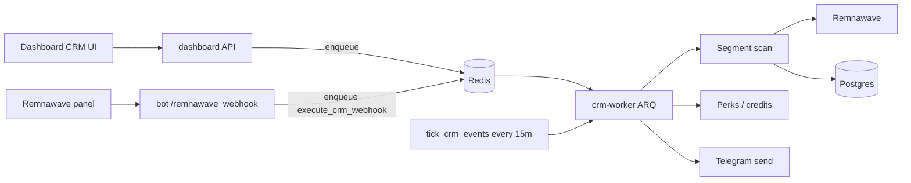

# CRM

The Dashboard **CRM** is a marketing automation engine for existing Telegram
users: segment an audience, apply Remnawave perks / bonus credits, and send
templated Telegram messages.

It is **not** a partner/lead CRM. Partnership inquiries from the web portal are
a separate fire-and-forget form — see [Web portal](web-portal.md).

**Source:**

| Layer | Path |
|-------|------|
| UI | `web/apps/dashboard/src/pages/crm/` — route `/crm` |
| API | `services/dashboard/backend/routers/crm.py` — `/bot/dashboard/api/crm/*` |
| Models | `packages/common_db/common_db/models/crm.py` |
| Worker | `crm-worker` container (same image as `dashboard`, ARQ over Redis) |

Ops notes (Redis, worker, UTC schedule): [Deployment](deployment.md).

## Prerequisites

| Dependency | Role |
|------------|------|
| `redis` | Job queue for campaign execution |
| `crm-worker` | ARQ worker — runs campaigns, scheduled events, and Remnawave webhook rules |
| Remnawave | Segment scans and perk actions |
| Bot token | Telegram delivery (`send_message` / buttons) |

If Redis or `crm-worker` is down, campaign launch returns **HTTP 503**.

```bash
docker compose up -d redis crm-worker
```

`REDIS_URL` defaults to `redis://redis:6379/0` in compose.

---

## Dashboard UI

**Route:** `/crm`

Tabs:

| Tab | Purpose |
|-----|---------|
| **Кампании (Campaigns)** | Build conditions + actions → preview audience → launch once |
| **События (Events)** | Recurring schedules (UTC); worker fires them automatically |
| **Webhooks** | Remnawave inbound events (`scope` + `event`) → CRM actions |
| **История (History)** | Past campaigns: sent / failed / perk counters, delivery detail |

### Typical campaign workflow

1. Open **Кампании**.
2. Add a **segment** condition (required) and optional filters.
3. Add one or more **actions** (Remnawave perks, credits, message).
4. **Preview** — live evaluate conditions (`POST /crm/conditions/evaluate`).
5. Optionally narrow recipients with **manual tg_id allowlist**.
6. **Launch** → job enqueued to Redis → `crm-worker` delivers → jump to History.

### Scheduled events

1. Open **События** → create event with the same conditions/actions model.
2. Set `run_at_time` (UTC `HH:MM`), frequency (`daily` / `weekly` + weekday),
   and repeat policy (`always` / `once` / `cooldown` + cooldown days).
3. Worker cron `tick_crm_events` runs every **15 minutes**.
4. At fire time: **fresh segment scan** (not a frozen recipient list) → linked
   campaign created (`event_id` FK) → deliveries tracked in `crm_event_deliveries`.
5. **Run now:** `POST /crm/events/{id}/run-now` from the Events tab.

Postgres stores `next_run_at` so schedules survive Redis restarts.

### Remnawave webhook rules

1. Open **Webhooks** → create a rule with **scope** + **event** (from the Remnawave
   catalog: `user`, `torrent_blocker`, `user_hwid_devices`).
2. Configure the same **actions** as campaigns (message, perks, credits).
3. Optional **cooldown hours** — skip re-delivery to the same user within the window.
4. Panel POSTs to `/bot/remnawave_webhook` → bot enqueues → `crm-worker` runs matching rules.

Webhook-only variables (also available with the usual CRM placeholders):
`{{notConnectedAfterHours}}`, `{{deviceModel}}`, `{{ip}}`, `{{blockMinutes}}`.

---

## Conditions → actions model

Since migration `0018_crm_conditions_actions`, campaigns and events store:

- `conditions_json` — audience rules (AND'd)
- `actions_json` — ordered side effects

Legacy flat columns (`segment_type`, `message_text`, `bonus_days`, …) are kept
as a mirror for history and older API clients via `crm_model_adapter.py`.

Deploy **dashboard frontend and backend together** when changing CRM shape.

### Conditions (AND)

| Type | Required | Description |
|------|----------|-------------|
| `segment` | **Yes** (max 1) | Remnawave + local DB segment scan |
| `user_type` | No | `all` / free / paid_vip |
| `tg_allowlist` | No | Restrict to selected `tg_id`s after preview |
| `rw_internal_squad` | No | User is in the given Remnawave internal squad |
| `rw_traffic_limit` | No | Traffic limit in GB (`0` = unlimited) |
| `rw_tag` | No | Remnawave user tag (UPPERCASE, no spaces) |

### Segments

| ID | Meaning | Extra params |
|----|---------|--------------|
| `all_users` | All non-banned users with `tg_id` | — |
| `never_connected` | Has subscription, no `firstConnectedAt` | — |
| `expired` | Remnawave status `expired` | — |
| `limited` | Status `limited` (traffic exhausted) | — |
| `traffic_low` | Used ≥ threshold of traffic limit | `traffic_threshold` (0.5–0.95) |
| `expiring_soon` | ≤ N days until `expire_at` | `days_threshold` (1–30) |
| `unpaid_invoice` | Local txs with status `created` | `invoice_max_age_hours` |
| `torrent` | From torrent-blocker reports | `torrent_days` |
| `device_limit` | Devices ≥ `hwidDeviceLimit` | — |

Catalog: `GET /crm/segments`. Evaluation: `POST /crm/conditions/evaluate`.

### Actions (ordered)

At least one enabled action is required. Remnawave / wallet actions run
**before** Telegram delivery.

| Type | Category | Effect |
|------|----------|--------|
| `rw_bonus_days` | Remnawave | Extend subscription by N days |
| `rw_bonus_traffic` | Remnawave | Add N GB traffic |
| `rw_reset_traffic` | Remnawave | Reset used traffic |
| `rw_set_status` | Remnawave | *(disabled in catalog)* |
| `credit_balance` | Wallet | Credit `users.bonus_credits` (`SOURCE_CRM`) |
| `send_message` | Telegram | HTML message with `{{variables}}` |
| `attach_button` | Telegram | `open_bot` or `invite_friends` deeplink |

Catalog: `GET /crm/actions/types`.

### Message variables

Templates support `{{ key }}` placeholders:

| Key | Example |
|-----|---------|
| `username` | `@alice` |
| `days_left` | `3` |
| `traffic_left` | `2 ГБ` |
| `traffic_percent` | `85` |
| `hwid_devices` | `2` |
| `status` | `limited` |

Catalog: `GET /crm/variables`. For webhook rules use `GET /crm/variables?context=webhook`
(adds webhook-only keys). Segment-specific canned texts: `GET /crm/templates?segment_id=…`.

---

## Data model

| Table | Purpose |
|-------|---------|
| `crm_campaigns` | Ad-hoc + event-spawned campaigns (`conditions_json`, `actions_json`, status counters) |
| `crm_campaign_deliveries` | Per-recipient result for a campaign |
| `crm_events` | Scheduled event definitions + `next_run_at` |
| `crm_event_deliveries` | De-dup / repeat-policy tracking for events |
| `crm_webhook_rules` | Remnawave webhook scope/event → actions (+ received/sent/failed counters) |
| `crm_webhook_deliveries` | Cooldown tracking for webhook rules |

Repos: `common_db.repo.crm`, `crm_events`, `crm_webhooks`, `crm_segments`.

---

## API surface (summary)

All under `/bot/dashboard/api/crm/` (JWT required):

| Area | Endpoints |
|------|-----------|
| Catalogs | `GET /segments`, `/conditions/types`, `/actions/types`, `/variables`, `/templates` |
| Preview | `POST /conditions/evaluate` |
| Campaigns | `GET /campaigns`, `POST /campaigns/launch`, `GET /campaigns/{id}` |
| Events | `GET/POST /events`, `PATCH/DELETE /events/{id}`, `POST /events/{id}/run-now` |
| Webhooks | `GET /webhooks/catalog`, `GET/POST /webhooks`, `PATCH/DELETE /webhooks/{id}` |
| Remnawave helpers | `GET /remnawave/internal-squads` |

---

## Architecture



---

## Troubleshooting

| Symptom | Fix |
|---------|-----|
| Launch returns 503 | Start `redis` + `crm-worker`; check `REDIS_URL` |
| Events never fire | Confirm `crm-worker` logs for `tick_crm_events`; times are **UTC** |
| Webhook rules never run | Confirm bot has `REDIS_URL`, `crm-worker` running, rule enabled + matching scope/event |
| Empty audience | Preview conditions; Remnawave connectivity; `user_type` filter too strict |
| Message sent, no perk | Check History delivery errors; Remnawave token / user UUID mapping |
| UI/API mismatch after update | Redeploy dashboard **frontend and backend** together |

## Related

- [Referral & promocodes](referral.md) — bonus credits wallet used by `credit_balance`
- [Dashboard](dashboard.md) — nav overview
- [Deployment](deployment.md) — Redis / worker / scheduling
- [Integrations](integrations.md) — Remnawave inbound webhooks → CRM Webhooks tab
