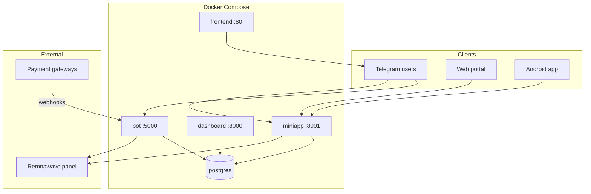

# Getting started — Overview

This page answers: *what is this project, what do I need, and what happens after
I deploy it?*

## What you get

XRAY VPN Bot is a **complete VPN sales stack**:

| Component | Who uses it | Purpose |
|-----------|-------------|---------|
| **Seller bot** | Telegram users | Registration, subscription delivery, VLESS links, optional in-bot purchase menu |
| **Dashboard** | Operator (you) | Admin panel: tariffs, users, payments, promos, CRM, support, analytics |
| **MiniApp** | Telegram users | Modern WebApp UI: buy, extend, devices, support, free trial |
| **Web portal** | Browser users | Separate SPA repo — invite-based registration, same backend API |
| **Android app** | Mobile users | Native client with JWT auth and Google Play IAP |
| **Admin bot** | Operator | Broadcasts, moderation, event logs (optional second bot token) |

All backends share **one PostgreSQL database** and provision VPN access through
the **Remnawave** panel.



## Prerequisites

Before deploying, prepare:

### Required

| Item | Notes |
|------|-------|
| **Server** | Linux host with Docker + Docker Compose v2 |
| **Domain + TLS** | Edge nginx (or Caddy/Traefik) terminates SSL |
| **Telegram bot** | Main bot token from [@BotFather](https://t.me/BotFather) |
| **Remnawave panel** | Running instance with API token and squad UUIDs |
| **PostgreSQL password** | Set in `.env` as `POSTGRES_PASSWORD` |

### Strongly recommended

| Item | Notes |
|------|-------|
| **Payment gateway** | At least one: CryptoBot, Crystal Pay, A-Pays, Platega, or ParityPay |
| **News channel** | Bot must be admin; used for free-trial channel check |
| **Dashboard secrets** | `dashboard_secret` and `android_jwt_secret` — `openssl rand -hex 32` |
| **SMTP** | For Android/web email verification |

### Optional

| Item | Notes |
|------|-------|
| Admin bot token | Separate bot for broadcasts and log alerts |
| Support bot token | Legacy standalone support bot (SQLite) |
| Telemt server | Host management from Dashboard |
| Google Play | Android IAP — service account + RTDN token |
| Web portal | Separate frontend on Vercel or your domain |

## Typical deployment flow

### 1. Clone and configure

```bash
git clone https://github.com/l0nelynx/xray-vpn-bot.git
cd xray-vpn-bot
cp config-example.yml config.yml
cp .env.example .env
# edit both files
```

See [Configuration](configuration.md) for every key.

### 2. Create Docker networks

```bash
docker network create backend-network
docker network create mail-net
```

`backend-network` is shared with your edge nginx. `mail-net` is used by miniapp
for outbound SMTP.

### 3. Start the stack

```bash
docker compose pull    # or build locally — see Deployment
docker compose up -d
```

Startup order: `postgres` (healthy) → `migrate` (Alembic) → `bot` / `dashboard` / `miniapp` → `frontend`.

### 4. Configure edge nginx

Route traffic by URL prefix. Full config: [Deployment → Reverse proxy](deployment.md#reverse-proxy).

| Path | Target |
|------|--------|
| `/bot/dashboard/api/` | `dashboard:8000` |
| `/bot/dashboard/` | `frontend:80` |
| `/bot/miniapp/api/` | `miniapp:8001` |
| `/bot/miniapp/` | `frontend:80` |
| `/bot/` | `bot:5000` (payment webhooks) |
| `/` | `frontend:80` or external web portal |

### 5. Register MiniApp in BotFather

1. `/mybots` → your bot → **Bot Settings** → **Menu Button** → configure Web App URL.
2. Set `miniapp_url` and `miniapp_tg_url` in `config.yml`.

### 6. Configure payment webhooks

Point each gateway's callback URL to your public domain, e.g.:

- `https://your-domain/bot/cryptopay_webhook`
- `https://your-domain/bot/crystal_webhook`
- `https://your-domain/bot/apays_webhook`
- `https://your-domain/bot/platega_webhook`
- `https://your-domain/bot/paritypay_webhook`

### 7. Build your product in the Dashboard

1. Open `https://your-domain/bot/dashboard/` and log in.
2. **WebApp → Settings** — Runtime (maintenance, branding, free plan, links) and
   Payments (enable gateways / paste credentials). Until you save here,
   `config.yml` remains the fallback ([dual-source](configuration.md#dual-source-configuration-yaml--dashboard)).
3. **Squads** — map Remnawave squad UUIDs to named profiles.
4. **WebApp → Tariff Constructor** — build the purchase menu tree (invoice leaves
   per payment method).
4. **Promocodes** — set credit grants and referral reward points
   ([referral.md](referral.md)).
5. **CRM** (optional) — ensure `redis` + `crm-worker` are up
   ([crm.md](crm.md)).

Changes to the tariff tree are live immediately — no bot restart needed.

### 8. Test end-to-end

1. Open the bot in Telegram → register (`/start`).
2. Open the MiniApp → navigate **Buy** → select a plan → pay.
3. Confirm subscription appears on **Home** and in Remnawave panel.
4. Check **Dashboard → Transactions** for the delivered order.

## Day-to-day operations

| Task | Where |
|------|-------|
| View revenue / users | Dashboard → Overview / Statistics |
| Reply to support tickets | Dashboard → Support |
| Change prices | Dashboard → WebApp → Tariff Constructor |
| Promo / referral settings | Dashboard → Promocodes |
| Segmented campaigns | Dashboard → CRM |
| Ban a user | Dashboard → Users |
| Broadcast announcement | Dashboard → TG Admin or CRM |
| Update images | `docker compose pull && docker compose up -d` |
| DB backup | `pg_dump` via host port `127.0.0.1:5432` |

## Where to go next

- **[Deployment](deployment.md)** — networks, images, migrations, scaling limits
- **[Configuration](configuration.md)** — full `config.yml` reference
- **[Dashboard](dashboard.md)** — every admin feature explained
- **[CRM](crm.md)** — campaigns, events, segments
- **[Referral & promocodes](referral.md)** — bonus credits wallet
- **[MiniApp](miniapp.md)** — user-facing WebApp flows
- **[Payment gateways](payment-gateways.md)** — setup + adding custom gateways
