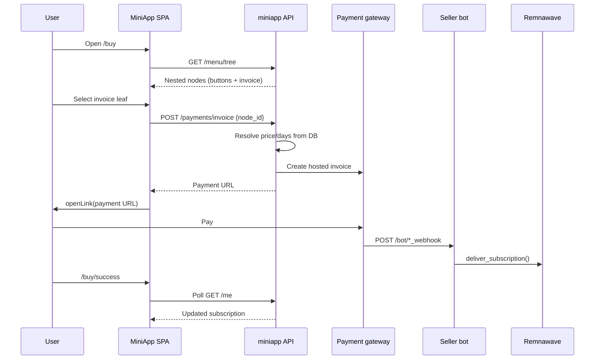

# MiniApp

The Telegram MiniApp is a **React + Vite SPA** served at `/bot/miniapp/`, backed
by the **miniapp FastAPI service** at `/bot/miniapp/api/`.

It is the primary user-facing purchase and subscription management interface
inside Telegram.

**Source:**

- Frontend: `web/apps/miniapp/`
- Backend: `services/miniapp/backend/`

The same backend also serves the [web portal](web-portal.md) and
[Android API](android-api.md) — this page covers the Telegram MiniApp client only.

## How users reach the MiniApp

1. User opens the main bot in Telegram.
2. Bot shows a WebApp button (configured in BotFather + `miniapp_url` in config).
3. Telegram loads the SPA and passes **init-data** for authentication.

Unregistered users see a **Welcome** screen directing them to `/start` in the bot.
Registration happens in the seller bot, not in the MiniApp.

## Authentication

Every API request includes the `X-Telegram-Init-Data` header.

**Backend validation** (`services/miniapp/backend/tg_auth.py`):

1. HMAC-SHA256 signature per [Telegram WebApp spec](https://core.telegram.org/bots/webapps#validating-data-received-via-the-mini-app)
2. TTL: 24 hours
3. Requires `user.id` and **`user.username`** (403 if username missing)

**Frontend** (`web/apps/miniapp/src/tg/webapp.ts`):

- Calls `Telegram.WebApp.ready()` and `expand()` on boot
- Passes `tg.initData` on every fetch

## App structure

Bottom tab navigation:

| Tab | Route | Page |
|-----|-------|------|
| Home | `/` | Subscription status, quick actions |
| Devices | `/devices` | HWID device list |
| Support | `/support` | Ticket inbox |
| Account | `/settings` | Promo, referral, legal links |

Additional routes (stack navigation):

| Route | Page | Purpose |
|-------|------|---------|
| `/buy` | BuyMenuPage | Tree-based tariff picker |
| `/buy/success` | BuySuccessPage | Post-payment polling |
| `/connect` | ConnectPage | VPN app install guide |
| `/free/:mode` | FreeTrialPage | Free VPN or Telemt proxy |
| `/support/new` | SupportCreatePage | New ticket |
| `/support/:id` | SupportTicketPage | Ticket thread |
| `/invite` | InvitePage | Referral code + share |
| `/referral-rules` | ReferralRulesPage | Program rules |
| `/policy`, `/agreement` | Legal pages | Privacy / agreement |

---

## Home

Shows the user's subscription card:

- Tariff name and status (active / expired)
- Days remaining
- Traffic usage
- Connected devices count

**Actions:**

- **Connect** — opens the Connect page (VPN app catalog)
- **Buy / Extend** — navigates to `/buy`
- **Free proxy** — entry to free Telemt trial (if configured)

Data from `GET /api/me` — resolves Remnawave subscription via `vless_uuid`.

---

## Buy flow

The purchase menu is **not hardcoded** — it comes from the Dashboard
[Tariff Constructor](dashboard.md#webapp-tariff-constructor) (`webapp_menu_nodes` table).



### Security rule

The client sends **`node_id` only**. Price, days, provider, and tariff slug are
read server-side from `webapp_menu_nodes` (`menu_invoice.py`). Never trust
client-supplied amounts.

### Promo discounts

Promo **percentage discounts on invoices are not used** anymore. Users redeem
codes for **bonus credits** and can pay with the wallet separately. See
[Referral & promocodes](referral.md).

### Post-payment

`BuySuccessPage` polls `GET /me` every 3 seconds for up to 3 minutes, watching
for `expire_iso` / `days_left` changes.

### Available providers

Configured in Dashboard invoice nodes:

| Provider | Methods |
|----------|---------|
| `crypto` | USDT, TON, BTC, ETH, … |
| `crystal` | RUB, USD, EUR |
| `apay` | RUB (SBP) |
| `platega` | SBP, ERIP, card, intl, crypto |
| `paritypay` | SBP, card |

---

## Connect page

**Route:** `/connect`

Custom "how to install VPN" UI — replaces redirecting users to the Remnawave
subscription page.

- Fetches app catalog: `GET /api/connect/app-config`
- Substitutes `{{SUBSCRIPTION_LINK}}` with the user's subscription URL from `/me`
- Per-platform install steps and deep-links

Customize the catalog without rebuilding: see [connect-page.md](connect-page.md).

---

## Devices

**Route:** `/devices`

Lists HWID devices registered in Remnawave for the user. Delete individual
devices via `DELETE /api/devices/{hwid}`.

---

## Free trial

**Route:** `/free/vpn` or `/free/telemt`

### Free VPN

1. Check channel subscription (`news_id`)
2. Claim free Remnawave access on the FREE squad
3. Duration/traffic from `free_days` / `free_traffic` in config

### Free Telemt proxy

Separate flow provisioning a Telemt user (requires `telemt_server` configured).

---

## Support

**Route:** `/support`

| Action | Endpoint |
|--------|----------|
| List tickets | `GET /api/support/tickets` |
| Create ticket | `POST /api/support/tickets` (max 5 open) |
| View thread | `GET /api/support/tickets/{id}` |
| Reply | `POST /api/support/tickets/{id}/messages` (text + up to 3 images) |
| View attachment | `GET /api/support/tickets/{id}/attachments/{attachment_id}` |

Admin replies from [Dashboard → Support](dashboard.md#support). User gets a
Telegram notification.

---

## Promo & referral

**Route:** `/settings`, `/invite`, `/referral-rules`

Full guide: **[Referral & promocodes](referral.md)**.

| Feature | Endpoint |
|---------|----------|
| Wallet + last code | `GET /api/promo` → `{ balance, last_promo_code, default_credit_grant }` |
| Activate code | `POST /api/promo` → credits wallet immediately |
| Referral card | `GET /api/promo/referral` → code, deeplink, points stats |

Referral codes are for **new users only** (no prior transactions). Promotional
codes can be redeemed by anyone (each code once). Owner rewards are **bonus
points**, not subscription days.

Settings: Dashboard → Promocodes.

---

## MiniApp API surface

All routes require `X-Telegram-Init-Data` unless noted.

```
GET  /api/me
GET  /api/menu/tree
GET  /api/payments/providers
POST /api/payments/invoice          # body: { "node_id": <int> }
GET  /api/promo
POST /api/promo
GET  /api/promo/referral
GET  /api/free/check
GET  /api/free/vpn/status
GET  /api/free/telemt/status
POST /api/free/claim
POST /api/free/telemt
GET  /api/devices
DELETE /api/devices/{hwid}
GET  /api/support/tickets
POST /api/support/tickets
GET  /api/support/tickets/{id}
POST /api/support/tickets/{id}/messages
GET  /api/support/tickets/{id}/attachments/{attachment_id}
GET  /api/connect/app-config      # public, cached
```

## BotFather setup checklist

1. Register MiniApp: `/mybots` → Bot Settings → Menu Button → Web App URL =
   `miniapp_url`.
2. Set app name for `miniapp_tg_url` (`https://t.me/YourBot/appname`).
3. Ensure `miniapp_url` is HTTPS and reachable by Telegram servers.
4. Build tariff menu in Dashboard → WebApp → Tariff Constructor.
5. Configure at least one payment gateway — see [payment-gateways.md](payment-gateways.md).

## Related clients

| Client | Doc | Auth |
|--------|-----|------|
| Web portal | [web-portal.md](web-portal.md) | JWT (email/password or Telegram OIDC) |
| Android app | [android-api.md](android-api.md) | JWT Bearer + Google Play IAP |

All three clients share `webapp_menu_nodes` and the same invoice security model
(`node_id` only).
