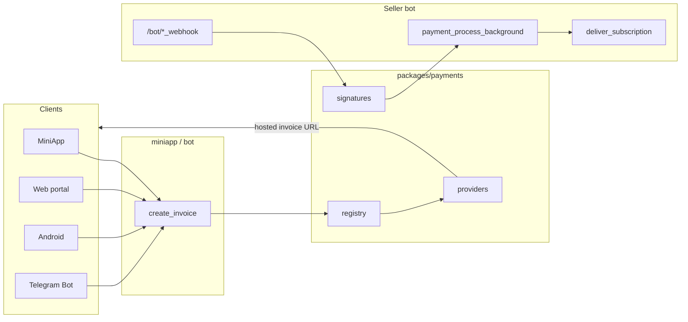

# Payment gateways

Payment processing is centralised in `packages/payments` and delivered through
the seller bot's webhook server. Clients (MiniApp, web portal, Android) create
invoices; gateways call back to confirm payment; the bot delivers the subscription.

## Architecture



| Layer | Location | Role |
|-------|----------|------|
| Providers | `packages/payments/payments/*.py` | Create hosted invoices |
| Signatures | `packages/payments/payments/signatures.py` | Verify webhook authenticity |
| Registry | `packages/payments/payments/registry.py` | Provider lookup |
| Config | `packages/payments/payments/config.py` | Credential injection |
| Webhooks | `services/bot/app/api/*.py` | HTTP endpoints on `:5000` |
| Delivery | `services/bot/app/api/handlers.py` | Unified subscription delivery |
| Invoice creation | `services/miniapp/backend/routers/payments.py` | MiniApp invoices |
| Menu resolution | `services/miniapp/backend/menu_invoice.py` | `node_id` → price/days/provider |

Providers never read `config.yml` directly — each service calls
`set_config_provider()` at startup.

## Built-in gateways

### Summary

| Registry name | `payment_method` (DB) | Currencies | Webhook route | Config keys |
|---------------|------------------------|------------|---------------|-------------|
| `crypto` | `CRYPTOPAY` | USDT, TON, BTC, ETH, LTC, BNB, TRX, USDC | `/bot/cryptopay_webhook` | `crypto_bot_token` |
| `crystal` | `CRYSTAL_PAY` | RUB, USD, EUR | `/bot/crystal_webhook` | `crystal_login`, `crystal_secret`, `crystal_salt`, `crystal_webhook` |
| `apay` | `SBP_APAY` | RUB | `/bot/apays_webhook` | `apay_id`, `apay_secret`, `apay_api_url` |
| `platega` | `PLATEGA` | RUB | `/bot/platega_webhook` | `platega_merchant_id`, `platega_api_key`, `platega_url`, `platega_payment_method` |
| `paritypay` | `PARITYPAY` | RUB | `/bot/paritypay_webhook` | `paritypay_shop_id`, `paritypay_secret_1`, `paritypay_secret_2`, `paritypay_url` |
| `stars` | `TG_STARS` | XTR | native Telegram update | `token` |

**Also supported outside hosted gateways:**

| Method | `payment_method` | Where handled |
|--------|------------------|---------------|
| Google Play IAP | — | `services/miniapp/backend/android/iap_router.py` |

### CryptoBot (`crypto`)

- API: `aiosend.CryptoPay` with `crypto_bot_token`
- Webhook auth: HMAC-SHA256 over raw body, key = `sha256(token)`
- Success: `update_type = invoice_paid`
- **Correlation ID:** CryptoPay `invoice_id` is stored in `provider_invoice_id`

Register webhook URL in @CryptoBot or rely on the HTTP endpoint.

### Crystal Pay (`crystal`)

- API: `POST https://api.crystalpay.io/v2/invoice/create/`
- Webhook auth: `sha1(id:salt)` must match signature field
- Success: `state == "payed"`
- Set `crystal_webhook` to `https://your-domain/bot/crystal_webhook`
- **Correlation ID:** provider invoice `id`

### A-Pays (`apay`)

- API: `GET {apay_api_url}/backend/create_order`
- Amount in **kopecks** (integer)
- Webhook auth: `md5(order_id:status:secret)`
- Success: `status == "approved"`
- **Correlation ID:** our UUID (`transaction_id`)

### Platega (`platega`)

- API: `POST {platega_url}/v2/transaction/process`
- Headers: `X-MerchantId`, `X-Secret`
- `paymentMethod` from invoice node `method` or `platega_payment_method` default
- Success: `status == "CONFIRMED"`
- **Correlation ID:** provider `transactionId`

**Sub-methods** (per invoice node `method` field):

| Value | Method |
|-------|--------|
| `2` | SBP |
| `3` | ERIP |
| `11` | Card |
| `12` | International |
| `13` | Crypto |

### ParityPay (`paritypay`)

- API: `POST {paritypay_url}/invoice/create`
- Outgoing sign: `paritypay_secret_1` → `X-SIGNATURE`
- Webhook sign: `paritypay_secret_2`
- `service` from node `method` (`sbp` / `card`) or `paritypay_service` default
- Success: `status == "PAID"`
- **Correlation ID:** our UUID (`order_id`)

---

## End-to-end payment flow

### 1. Configure invoice nodes (Dashboard)

**WebApp → Tariff Constructor** — create `invoice` leaves with provider, amount,
currency, method, days, internal/external squads, traffic policy and optional
Remnawave description/tag. See [Dashboard](dashboard.md).

### 2. User selects a plan (MiniApp / web / Android)

```
GET /api/menu/tree          → display menu
POST /api/payments/invoice  → { "node_id": 42 }
```

Server reads `webapp_menu_nodes`, creates the gateway invoice via
`payments.create_invoice()`, and stores the complete immutable delivery target
in a `transactions` row. Bonus credits are a
separate wallet (pay-with-credits) — see [referral.md](referral.md).

### 3. User pays at the gateway

Client opens the hosted payment URL via Telegram `openLink()` or browser redirect.

### 4. Gateway calls webhook

```
POST https://your-domain/bot/platega_webhook
```

Edge nginx routes `/bot/` → `bot:5000`.

### 5. Bot verifies and delivers

1. Signature check (`payments.signatures`)
2. `payment_process_background(order_id)` — atomic claim `created → confirmed`
3. `deliver_subscription()` — extend/create Remnawave user
4. Transaction status → `delivered`

On failure: 3 retries, then `pending` + admin Telegram alert.

### Correlation ID rules

`transactions.transaction_id` is always a local UUID. Gateway identifiers are
stored separately in `provider_invoice_id`; webhook handlers resolve either
merchant UUID or provider ID before claiming the local transaction:

| Correlation mode | Providers |
|------------------|-----------|
| Merchant/local UUID | APay, ParityPay, Stars |
| Provider invoice ID | CryptoPay, Crystal Pay, Platega |

---

## Exposing payment methods to users

### Dashboard (authoring)

- **UI:** `web/apps/dashboard/src/pages/WebAppTariffsPage.tsx`
- **Provider catalog:** `GET /api/webapp-menu/providers`
  (`services/dashboard/backend/routers/webapp_payments.py`)

The catalog is generated from the payments registry and includes methods,
currencies, supported surfaces and webhook-ID mapping.

### MiniApp / web / Android (runtime)

- Menu tree: `GET /api/menu/tree`
- Create invoice: `POST /api/payments/invoice` with `{ node_id }` only
- Provider list (informational): `GET /api/payments/providers`

### Telegram Bot

The same Tariff Constructor tree is rendered through stateless callbacks.
Hosted gateways use the registry; Stars use a native Telegram invoice.

### Dashboard revenue stats

`services/dashboard/backend/currency.py` maps each `payment_method` to native
currency for RUB-normalized reporting.

---

## Adding a custom payment gateway

Follow these phases in order. Replace `mygateway` with your gateway's short name.

### Phase A — Shared package

**1. Create the provider** — `packages/payments/payments/mygateway.py`:

```python
from payments.base import Invoice, InvoiceRequest, PaymentProvider, PaymentError
from payments.config import get_config

class MyGatewayProvider(PaymentProvider):
    name = "mygateway"                    # registry key
    payment_method = "MYGATEWAY"            # stored in transactions.payment_method
    supported_currencies = ("RUB",)

    async def create_invoice(self, request: InvoiceRequest) -> Invoice:
        cfg = get_config()
        # Call gateway API using cfg.mygateway_* credentials
        # Use request.transaction_id as merchant order id
        return Invoice(
            invoice_id=...,       # ID webhook will reference
            payment_url=...,      # URL user opens to pay
        )
```

**2. Add signature verification** — `packages/payments/payments/signatures.py`:

```python
def verify_mygateway_webhook(payload: bytes, signature: str, secret: str) -> bool:
    expected = ...  # compute per gateway docs
    return hmac.compare_digest(expected, signature)
```

**3. Register** — `packages/payments/payments/registry.py`:

```python
from payments.mygateway import MyGatewayProvider

for _provider_cls in (
    APayProvider,
    # ...
    MyGatewayProvider,   # add here
):
    register_provider(_provider_cls())
```

**4. Extend config dataclass** — `packages/payments/payments/config.py`:

```python
@dataclass(frozen=True)
class PaymentsConfig:
    # ...
    mygateway_api_key: str = ""
    mygateway_secret: str = ""
```

**5. Add tests** — `packages/payments/tests/test_signatures.py`

### Phase B — Seller bot webhooks

**6. Webhook handler** — `services/bot/app/api/mygateway.py`:

```python
@router.post("/bot/mygateway_webhook")
async def mygateway_webhook(request: Request, background_tasks: BackgroundTasks):
    body = await request.body()
    if not signatures.verify_mygateway_webhook(body, request.headers.get("X-Sign"), secret):
        raise HTTPException(403)
    data = await request.json()
    if data["status"] != "PAID":
        return {"ok": True}
    background_tasks.add_task(payment_process_background, data["order_id"])
    return {"ok": True}
```

**7. Register route** — `services/bot/main.py` (with slowapi rate limit).

**8. Wire config** — `services/bot/app/settings.py` → map keys in `_payments_config()`.

**9. Document keys** — `config-example.yml`.

### Phase C — Shared runtime exposure

**10. Wire config** in the runtime overlay and set provider metadata:

```python
methods = (("default", "Default"),)
surfaces = frozenset({"bot", "miniapp", "web", "android"})
webhook_key = "provider"  # or "merchant"
```

The invoice routers always persist a local UUID plus `provider_invoice_id`; no
provider-specific persisted-ID branch is needed.

### Phase D — Dashboard exposure

**12. Register the provider** in `payments.registry`; Dashboard discovers its
catalog metadata automatically.

**13. Currency mapping** — `services/dashboard/backend/currency.py` → `PAYMENT_CURRENCY`.

**14. Transaction filter (optional)** — `web/apps/dashboard/src/components/TransactionsTable.tsx`.

No Tariff Constructor code changes needed — admins pick the new provider in invoice nodes.

### Phase E — Telegram Bot

If `surfaces` contains `bot`, the same Tariff Constructor node works in the
Telegram Bot automatically; no keyboard or handler branch is added.

### Phase F — Operations

16. Register `https://your-domain/bot/mygateway_webhook` with the gateway
17. Create invoice nodes in Dashboard → WebApp → Tariff Constructor
18. Test: invoice → pay → webhook → subscription delivered → transaction `delivered`

---

## Checklist for a new gateway

- [ ] Provider class with `name`, `payment_method`, `create_invoice()`
- [ ] Signature verification + unit test
- [ ] Registered in `registry.py`
- [ ] `PaymentsConfig` fields + bot/miniapp config wiring
- [ ] Webhook handler + route in `main.py`
- [ ] `persisted_id` rule in all invoice routers
- [ ] Registry metadata: methods, currencies, surfaces and webhook key
- [ ] `PAYMENT_CURRENCY` mapping
- [ ] `config-example.yml` keys documented
- [ ] Public webhook URL registered with gateway provider
- [ ] Invoice nodes created in Tariff Constructor
- [ ] End-to-end test with real payment

## Key design rules

1. **`transaction_id` is the correlation key** — design invoice creation and webhook handling together.
2. **Clients send `node_id` only** — never trust client amount/days/provider.
3. **Config injection** — providers use `get_config()`, not direct `config.yml` imports.
4. **`payment_method` strings are stable** — they appear in transactions, stats, and admin notifications.
5. **Single provider catalog** — Dashboard derives it from the payments registry metadata.
6. **Delivery is centralized** — webhooks only verify + enqueue; `payment_process_background` handles all gateways.

## Troubleshooting

| Symptom | Likely cause |
|---------|--------------|
| Webhook 403 | Wrong signature secret or header name |
| Payment OK, no subscription | `transaction_id` mismatch between invoice and webhook |
| Invoice creation fails | Missing config keys or provider not registered |
| Provider not in Dashboard dropdown | Missing registry metadata or unsupported surface |
| 413 on webhook | Edge nginx `client_max_body_size` too low (rare for JSON webhooks) |
| All clients share one rate-limit bucket | Missing `X-Real-IP` header on edge nginx |

## Related docs

- [Configuration](configuration.md) — gateway config keys
- [Deployment](deployment.md) — webhook routing via edge nginx
- [MiniApp](miniapp.md) — buy flow from user perspective
- [Seller bot](seller-bot.md) — webhook server details
- [Dashboard](dashboard.md) — Tariff Constructor
