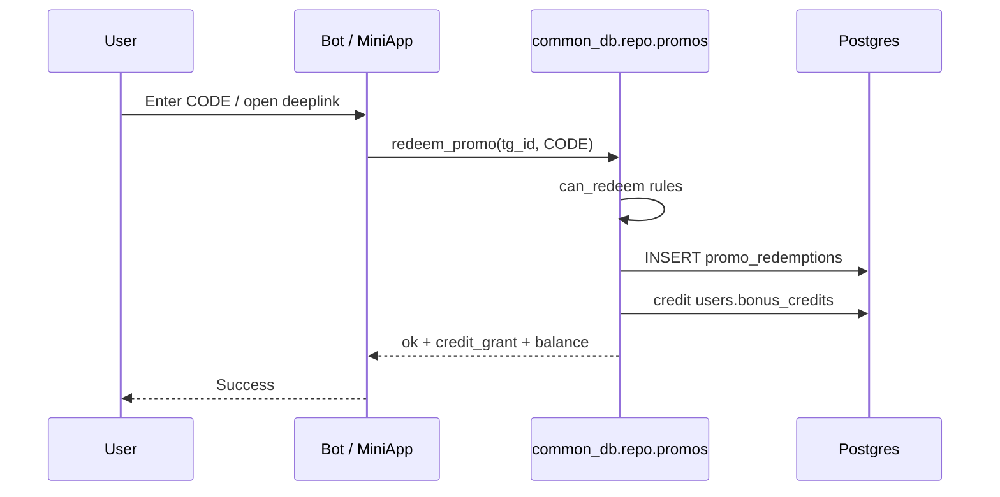
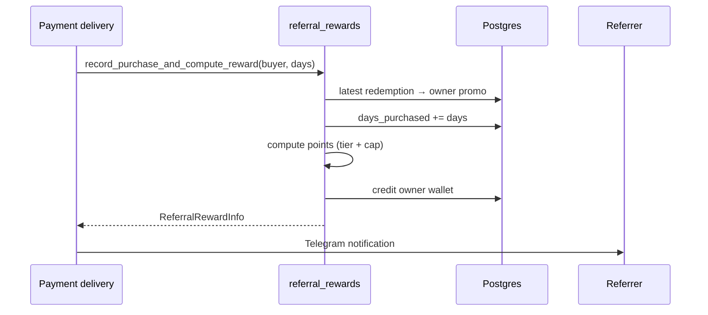

# Referral & promocodes

Promo codes double as the **referral program**. Every user gets a personal
referral code; activating someone else's code credits the activator's **bonus
wallet**, and when invitees buy a subscription the code owner earns **bonus
points** (same wallet).

!!! important "Model change"
    Older designs used invoice **discount %** and reward **subscription days**.
    Since migrations `0019`–`0021` the system uses an instant **bonus credits /
    points** wallet (`users.bonus_credits` + `credit_ledger`). Percentage
    discounts on invoices are no longer applied.

**Source of truth:** `packages/common_db/common_db/repo/promos.py` and
`referral_rewards.py` — shared by bot, miniapp, and dashboard.

---

## Concepts

| Concept | Meaning |
|---------|---------|
| **Referral code** | User-owned (`promo_type=referral`), auto-created on invite screen |
| **Promotional code** | Admin/dashboard marketing code (`promo_type=promotional`), usually owned by a synthetic negative `tg_id` |
| **Redemption** | Audit row in `promo_redemptions` — who activated which code |
| **Bonus credits / points** | Balance on `users.bonus_credits`; can pay for plans or be granted by CRM |
| **Owner reward** | Points credited to the referral code owner when invitees purchase |

### Code format

- 8 characters, `A–Z` + `0–9`
- Deeplink: `{bot_url}?start={CODE}` (from `bot_url` in `config.yml`)

---

## Redemption rules

Enforced by `can_redeem` / `redeem_promo`:

| Rule | Behavior |
|------|----------|
| Code must exist | Otherwise `invalid` |
| Not own code | `own_code` |
| Same code twice | `already_used` |
| Referral → new users only | User must have **zero** transactions (`referral_not_new`) |
| One referral ever | At most one `promo_type=referral` redemption per user (`referral_only_one`) |
| Promotional | Anyone (subject to “same code once”); can redeem multiple different promotional codes over time |

On success:

1. Insert `promo_redemptions` audit row
2. Immediately credit the **redeemer's** wallet (`SOURCE_PROMO`)
3. Amount = `Promo.credit_grant` if set, else `PromoSettings.default_credit_grant`

There is no longer an “active / consumed” discount state — credits are granted
at activation time.

---

## Owner reward formula

Called on **paid subscription delivery** (all surfaces) via
`record_purchase_and_compute_reward(buyer_tg_id, days)`:

1. Find buyer's latest redemption → look up that code's owner
2. Bump `promo.days_purchased` by purchased days
3. Compute:

```
reward = (days_purchased // 30) * points_reward_per_30 - points_rewarded
reward = clamp(reward, 0, reward_cap_points - points_rewarded)
```

4. If `reward > 0`: credit owner's wallet (`SOURCE_PROMO`, reference
   `referral:{code}`), bump `points_rewarded`, notify owner in Telegram

Defaults (singleton `promo_settings`, editable in Dashboard):

| Setting | Default | Meaning |
|---------|---------|---------|
| `default_credit_grant` | `100` | Points granted to redeemer when code has no override |
| `points_reward_per_30` | `30` | Owner points per 30 invitee-days purchased |
| `reward_cap_points` | `1800` | Cumulative owner reward cap per code |

---

## Bonus wallet

| Field / table | Role |
|---------------|------|
| `users.bonus_credits` | Current balance |
| `credit_ledger` | Append-only ledger (`SOURCE_PROMO`, `SOURCE_CRM`, `SOURCE_PAYMENT`, `SOURCE_ADMIN`, …) |

**Earn:**

- Redeem a promo / referral code
- Referral owner rewards on invitee purchases
- CRM action `credit_balance`
- Admin adjustment in Dashboard → Users

**Spend:**

- Pay for a plan with credits (bot pay keyboard / MiniApp `pay_with_credits`)
- Admin debit

---

## Surfaces

### Bot

| Entry | Behavior |
|-------|----------|
| `?start=CODE` | Auto-redeem alphanumeric start payload (reserved: `buy`, `extend`, `trial`, `link_*`) |
| Manual entry | Payment / promo handlers → `redeem_promo_for_user` |
| Invite friends | Shows code + stats from `promo_settings` |

Reward payout: `subscription_service` after delivery.

### MiniApp

| Endpoint | Purpose |
|----------|---------|
| `GET /api/promo` | Balance, last redeemed code, default grant |
| `POST /api/promo` | Activate code → `{ credit_grant, balance }` |
| `GET /api/promo/referral` | Code, deeplink, settings, `days_purchased`, `points_rewarded` |

UI: `/invite` (InvitePage), `/referral-rules`, Settings entry.

### Web portal

Invite validation / register in `web_router.py`. Web-only users use a
**synthetic negative** `tg_id` (`-user.id`) as the promo key; users linked to
Telegram use their real `tg_id`.

### Android

Same shared promo repo via miniapp Android routers (`android/promo_router.py`).

### Dashboard

**Route:** `/promocodes`

**Codes tab:**

- List / search / filter by type
- Create promotional codes with optional `credit_grant` override
- View redeemers, usage count, invitee days, owner points rewarded
- Delete code (cascades redemption history)

**Settings tab:**

- `default_credit_grant`
- `points_reward_per_30`
- `reward_cap_points`

API: `/bot/dashboard/api/promos`, `/promos/settings`, `/promos/{code}/users`.

---

## Data model

### `promos` (code catalog)

| Column | Meaning |
|--------|---------|
| `tg_id` | Owner (unique); synthetic negative for admin marketing codes |
| `promo_code` | Unique 8-char code |
| `promo_type` | `referral` or `promotional` |
| `days_purchased` | Cumulative invitee purchase-days |
| `points_rewarded` | Owner points already paid |
| `credit_grant` | Redeemer grant override; `NULL` → settings default |
| `discount_percent`, `used_promo`, `used_promo_consumed` | **Legacy** — kept for migration history |

### `promo_redemptions` (audit log)

| Column | Meaning |
|--------|---------|
| `tg_id` | Who redeemed |
| `promo_code` | Which code |
| `promo_type` | Snapshot of code type at redeem time |
| `created_at` | When |

No status/discount columns — credit is instant.

### `promo_settings` (singleton `id=1`)

See settings table above. Auto-seeded on first read.

---

## Flow diagrams

### Redeem



### Owner reward on purchase



---

## Admin checklist

1. Set defaults in **Dashboard → Promocodes → Settings**.
2. (Optional) Create promotional codes with custom `credit_grant`.
3. Ensure `bot_url` is correct so deeplinks work.
4. Test: new Telegram account opens `t.me/bot?start=CODE` → credits appear.
5. Test: invitee buys a plan → owner receives points (capped).
6. Confirm users can spend credits on a plan.

---

## Troubleshooting

| Symptom | Cause |
|---------|-------|
| “Referral codes are for new users only” | Buyer already has a transaction |
| “Already used a referral code” | Second referral redemption blocked |
| Owner gets no reward | Buyer never redeemed a code, or reward already at cap / below next 30-day tier |
| Credits granted but can't pay | Insufficient balance vs plan price in points; check MiniApp/bot pay-with-credits path |
| Different behavior bot vs MiniApp | Should not happen — both use `common_db.repo.promos`; update all services |

## Related

- [CRM](crm.md) — can also credit the same wallet via `credit_balance`
- [Dashboard](dashboard.md) — Promocodes UI
- [MiniApp](miniapp.md) — Invite / settings pages
- [Database](database.md) — table overview
