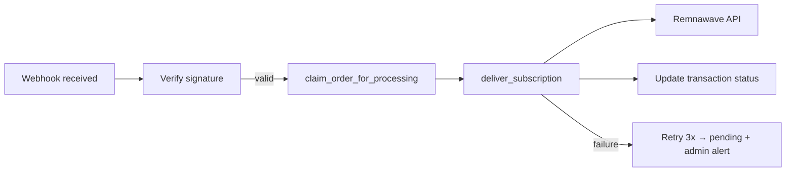

# Seller bot

The seller bot is the main Telegram bot and payment webhook server. It handles
user registration, subscription delivery, optional in-bot purchase menus, and
admin commands.

**Source:** `services/bot/` — entry point `main.py`

| Role | Port | Network alias |
|------|------|---------------|
| Telegram polling (aiogram 3.x) | — | — |
| FastAPI webhooks (uvicorn) | `:5000` | `seller-bot` (backwards compat) |

!!! warning "Single instance"
    Telegram long-polling and in-process rate limiters mean the bot container
    must run as **one replica**. Do not scale horizontally without externalising
    state.

## User-facing features

### Registration (`/start`)

1. User sends `/start` (optionally with deep-link payload: promo code, Android
   link code `link_<code>`, etc.).
2. Bot creates a `users` row with `tg_id`, username, language.
3. Provisions or links a Remnawave user (`vless_uuid`).
4. Sends welcome message with MiniApp button.

### Subscription management

- Check subscription status and expiry
- Display VLESS subscription link
- Traffic reset (where configured)
- HWID device management (via MiniApp — bot may show summary)

### MiniApp entry

Bot messages include a WebApp button pointing to `miniapp_url`. Users manage
purchases, devices, and support primarily through the [MiniApp](miniapp.md).

### Free plan

Users can claim a free VPN subscription (channel subscription check against
`news_id`). Parameters from `free_days` / `free_traffic` in config.

### Promo codes

Users can activate promo codes via bot commands, deeplink (`?start=CODE`), or the
MiniApp. Activation credits the **bonus wallet** immediately. Referral codes
reward the owner in points when invitees purchase — see [referral.md](referral.md).

## Payment webhooks

The bot runs a FastAPI server that receives payment gateway callbacks. SSL
terminates at the edge nginx — routes `/bot/*` to `bot:5000`.

| Webhook route | Gateway | Rate limit |
|---------------|---------|------------|
| `POST /bot/cryptopay_webhook` | CryptoBot | 60/min |
| `POST /bot/crystal_webhook` | Crystal Pay | 30/min |
| `POST /bot/apays_webhook` | A-Pays | 30/min |
| `POST /bot/platega_webhook` | Platega | 60/min |
| `POST /bot/paritypay_webhook` | ParityPay | 60/min |
| `POST /bot/remnawave_webhook` | Remnawave panel | — |

### Delivery pipeline

All payment webhooks follow the same flow:



Implementation: `services/bot/app/api/handlers.py` → `payment_process_background()`.

### Remnawave inbound webhook

Verifies HMAC, acks, and enqueues to `crm-worker` for CRM Webhook rules.
See [Integrations](integrations.md) and [CRM](crm.md).

## Legacy bot constructor (optional)

Disabled by default (`legacy_bot_constructor = false`).

When enabled via Dashboard → WebApp → Settings (requires bot restart):

- In-bot tariff keyboard with Stars, Crypto, Crystal, SBP/A-Pays
- Dynamic inline menus from `menu_screens` / `menu_buttons`
- Prices from `tariff_plans` / `tariff_prices` (Dashboard → Tariffs/Menus)

**Platega and ParityPay are not available in the legacy constructor** — only
via MiniApp/web/Android Tariff Constructor.

Handler: `services/bot/app/bot_constructor/handlers/payments.py`

!!! note "CryptoBot dual path"
    Legacy in-bot CryptoBot flow uses `@cp.invoice_paid()` polling (aiosend).
    MiniApp/web CryptoBot uses the HTTP webhook at `/bot/cryptopay_webhook`.

## Admin bot

If `admin_bot_token` is set, a separate admin bot runs alongside the main bot.

### In-bot admin commands (main bot)

Available to `admin_id`:

- User lookup, ban/unban
- View recent logs
- Manual operations

### Admin bot features

- Broadcast messages to users
- Event log channel (`logs_id`) — registrations, invoices, deliveries, errors
- Moderation alerts

Dashboard **TG Admin** page provides a web UI for broadcasts and bulk operations.

## Android account linking

When an Android user starts linking (`POST /api/android/link/start`), the bot
handles `/start link_<code>`:

1. Validates one-time link code
2. Binds `users.tg_id` to the Android account
3. Merges subscription data if needed

Handler: `services/bot/app/handlers/android_link.py`

## Project layout

```
services/bot/
├── main.py                    # Entry: aiogram polling + FastAPI uvicorn
├── app/
│   ├── handlers/              # User commands, registration, android link
│   ├── admin/                 # Admin bot handlers
│   ├── api/                   # Payment webhook endpoints
│   │   ├── handlers.py        # payment_process_background (shared delivery)
│   │   ├── crypto_pay.py
│   │   ├── crystal_pay.py
│   │   ├── a_pay.py
│   │   ├── platega.py
│   │   └── paritypay.py
│   ├── bot_constructor/       # Legacy in-bot menus (feature-flagged)
│   ├── keyboards/             # Inline keyboards
│   ├── locale/                # i18n strings
│   ├── database/              # Shim re-exporting common_db + engine
│   └── settings.py            # Config load + payments config provider
```

## Configuration

Key `config.yml` entries for the bot — full list in [Configuration](configuration.md):

| Key | Purpose |
|-----|---------|
| `token` | Main bot token |
| `admin_bot_token` | Admin bot (optional) |
| `admin_id` | Admin Telegram user ID |
| `uvicorn_host` / `uvicorn_port` | Webhook server bind |
| `remnawave_*` | Panel connection |
| Payment gateway keys | See [payment-gateways.md](payment-gateways.md) |

## Health check

```
GET http://bot:5000/health
```

Used by Docker Compose healthcheck.

## Troubleshooting

| Symptom | Fix |
|---------|-----|
| Bot doesn't start, CryptoBot error | `crypto_bot_token` is validated on import — use real token or leave empty and don't import payment handlers |
| Webhooks 404 | Edge nginx must route `/bot/` to `bot:5000` |
| Payment received, no subscription | Check bot logs; verify `transaction_id` correlation — see [payment-gateways.md](payment-gateways.md) |
| Remnawave delivery fails | Verify squad UUIDs and API token |
| Legacy menus not updating | Dashboard writes bump `cache_version`; bot polls tariff cache |

## Related docs

- [MiniApp](miniapp.md) — primary purchase UI
- [Payment gateways](payment-gateways.md) — gateway setup and custom integration
- [Dashboard](dashboard.md) — tariff/menu configuration
- [Integrations](integrations.md) — Remnawave webhooks
